Contents
=================

- [在 KubeSphere 上部署 RadonDB ClickHouse](#在-kubesphere-上部署-radondb-clickhouse)
  - [简介](#简介)
  - [部署准备](#部署准备)
  - [部署步骤](#部署步骤)
    - [步骤 1 : 部署 RadonDB ClickHouse Operator](#步骤-1--部署-radondb-clickhouse-operator)
    - [步骤 2 : 添加应用仓库](#步骤-2--添加应用仓库)
    - [步骤 3：部署 ClickHouse 集群](#步骤-3部署-clickhouse-集群)
    - [步骤 4：部署验证](#步骤-4部署验证)
  - [访问 RadonDB ClickHouse](#访问-radondb-clickhouse)

# 在 KubeSphere 上部署 RadonDB ClickHouse

## 简介

RadonDB ClickHouse 是基于 [ClickHouse](https://clickhouse.tech/) 的开源、高可用、云原生集群解决方案。

本教程演示了如何在 KubeSphere 上部署 ClickHouse Operator 和 ClickHouse 集群。

## 部署准备

- 已成功部署 KubeSphere 集群，且[已启用 OpenPitrix 系统](https://kubesphere.io/zh/docs/pluggable-components/app-store/)和[已创建企业空间、项目、帐户和角色](https://kubesphere.io/zh/docs/quick-start/create-workspace-and-project/)。
- [已开启 KubeSphere 外网访问](https://kubesphere.io/zh/docs/project-administration/project-gateway/)。

## 部署步骤

### 步骤 1 : 部署 RadonDB ClickHouse Operator

以 `admin` 身份登录 KubeSphere 的 Web 控制台，并使用**工具箱**中的 **Kubectl** 执行以下命令来安装 ClickHouse Operator。建议至少准备 2 个可用集群节点。

```bash
kubectl apply -f https://raw.githubusercontent.com/radondb/radondb-clickhouse-kubernetes/main/clickhouse-operator-install.yml
```

> **注意**
> 
> RadonDB ClickHouse Operator 将会被安装在 `kube-system` 命名空间下，因此一个 KubeSphere 集群只需要安装一次 ClickHouse Operator。

**预期结果**

```powershell
customresourcedefinition.apiextensions.k8s.io/clickhouseinstallations.clickhouse.altinity.com configured
customresourcedefinition.apiextensions.k8s.io/clickhouseinstallationtemplates.clickhouse.altinity.com created
customresourcedefinition.apiextensions.k8s.io/clickhouseoperatorconfigurations.clickhouse.altinity.com created
serviceaccount/clickhouse-operator created
clusterrolebinding.rbac.authorization.k8s.io/clickhouse-operator-kube-system created
configmap/etc-clickhouse-operator-files created
configmap/etc-clickhouse-operator-confd-files created
configmap/etc-clickhouse-operator-configd-files created
configmap/etc-clickhouse-operator-templatesd-files created
configmap/etc-clickhouse-operator-usersd-files created
deployment.apps/clickhouse-operator created
service/clickhouse-operator-metrics created
```

### 步骤 2 : 添加应用仓库

1. 以 `ws-admin` 身份登录 KubeSphere 的 Web 控制台。在企业空间中，进入**应用管理**下的**应用仓库**页面，点击**添加仓库**。

   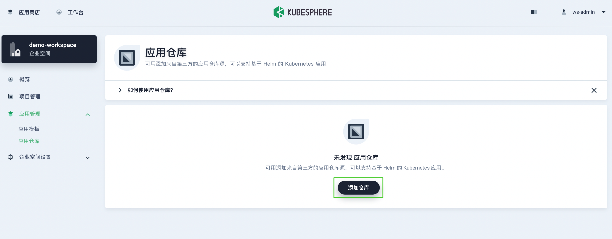

2. 在出现的对话框中，输入 `clickhouse` 作为应用仓库名称，输入 `https://radondb.github.io/radondb-clickhouse-kubernetes/` 作为仓库的 URL。点击**验证**以验证 URL。在 URL 旁边呈现一个绿色的对号，验证通过后，点击**确定**继续。

   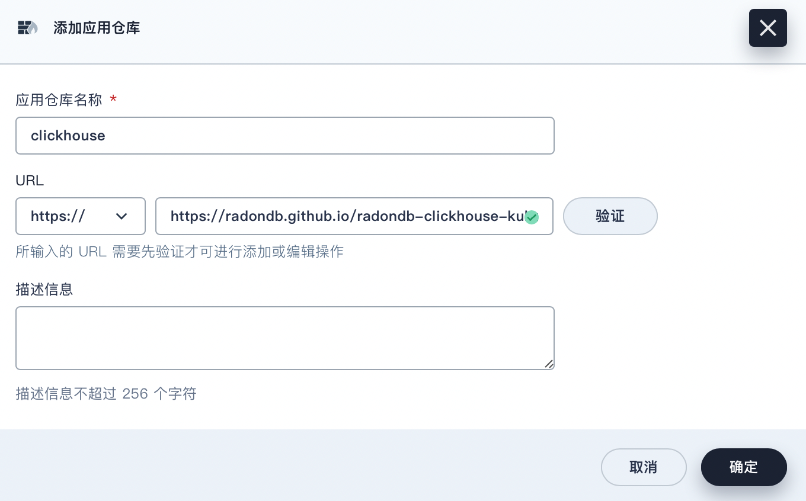

3. 将仓库成功导入到 KubeSphere 之后，在列表中可查看 ClickHouse 仓库。

   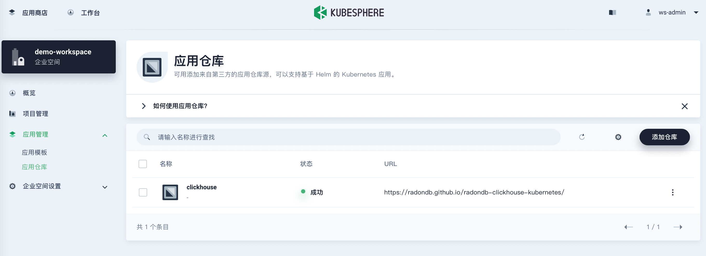

### 步骤 3：部署 ClickHouse 集群

1. 以 `project-regular` 身份登录 KubeSphere 的 Web 控制台。在 `demo-project` 项目中，进入**应用负载**下的**应用**页面，点击**部署新应用**。

   

2. 在对话框中，选择**来自应用模板**。

   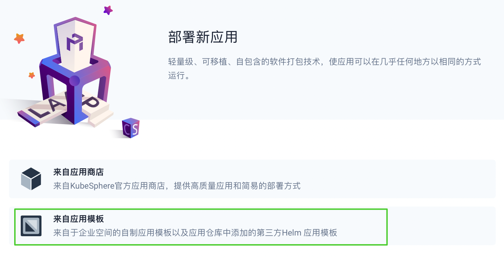

3. 从下拉菜单中选择 `clickhouse` 应用仓库 ，然后点击 **clickhouse-cluster**。

   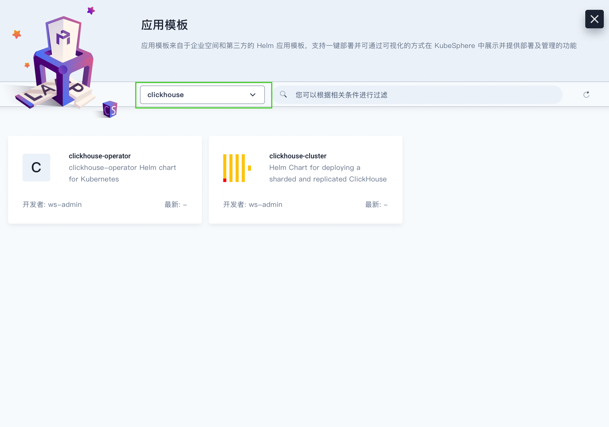

4. 在**配置文件**选项卡，可以直接通过控制台查看配置信息，也可以通过下载默认 `values.yaml` 文件查看。在**版本**列框下，选择一个版本号，点击**部署**以继续。
   
   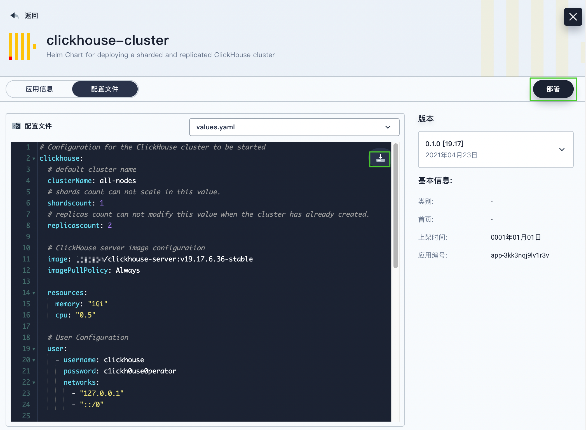

5. 在**基本信息**页面，确认应用名称、应用版本以及部署位置。点击**下一步**以继续。

   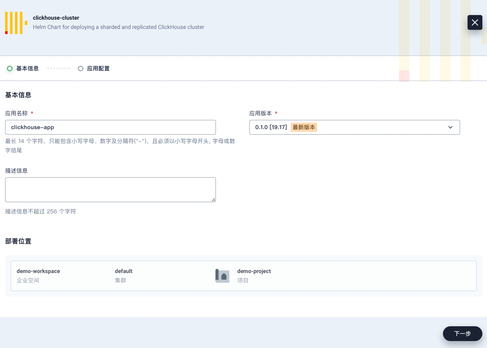

6. 在**应用配置**页面，可以编辑 `values.yaml` 文件，也可以直接点击**部署**使用默认配置。

   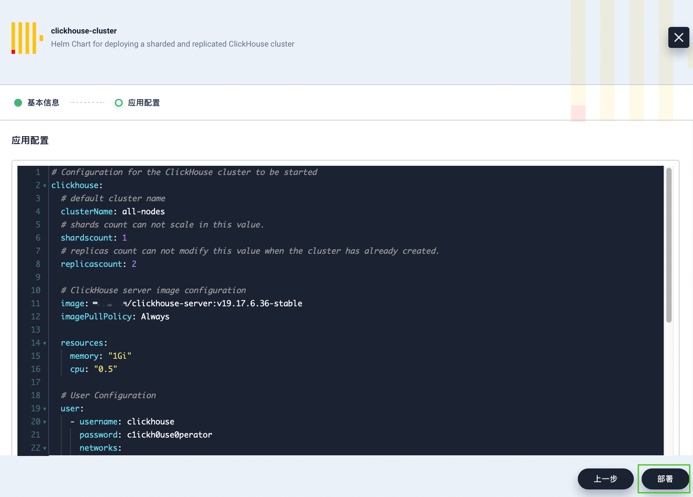

7. 等待 ClickHouse 集群正常运行。可在**工作负载**下的**应用**页面，查看部署的应用。

   

### 步骤 4：部署验证

1. 以 `project-regular` 身份登录 KubeSphere 的 Web 控制台。

2. 进入**应用负载**下的**工作负载**页面，点击**有状态副本集**，查看集群状态。

   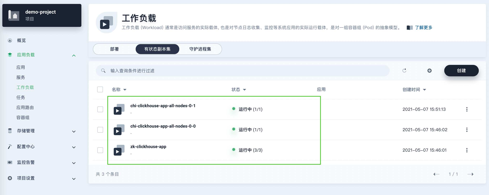

   进入一个有状态副本集群详情页面，点击**监控**标签页，可查看一定时间范围内的集群指标。

   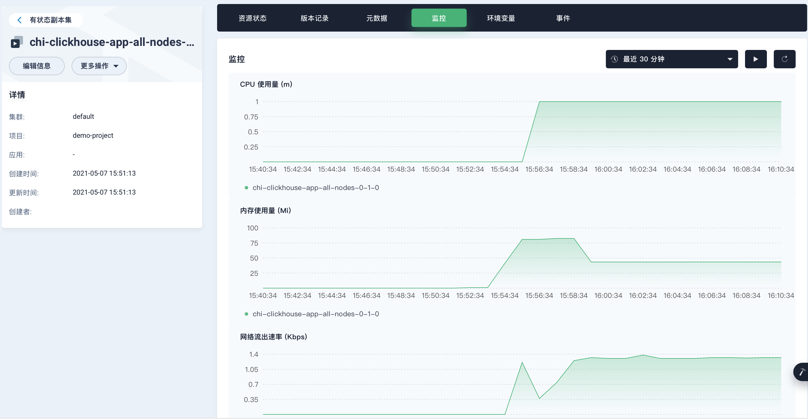

3. 进入**应用负载**下的**容器组**页面，可查看所有状态的容器。

   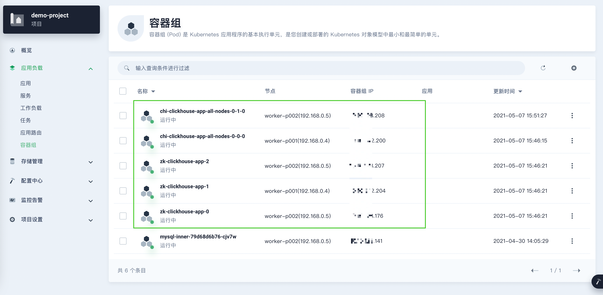

4. 进入**存储管理**下的**存储卷**页面，可查看存储卷，所有组件均使用了持久化存储。

   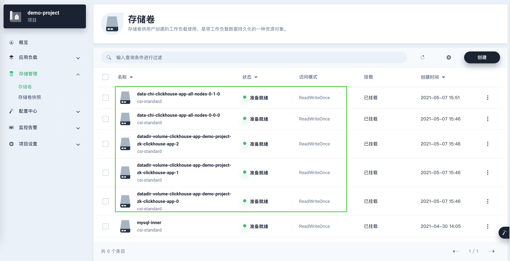

   查看某个存储卷用量信息，以其中一个数据节点为例，可以看到当前存储的存储容量和剩余容量等监控数据。

   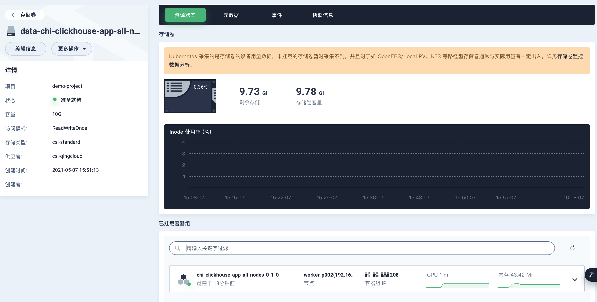

5. 在项目**概览**页面，可查看当前项目资源使用情况。

   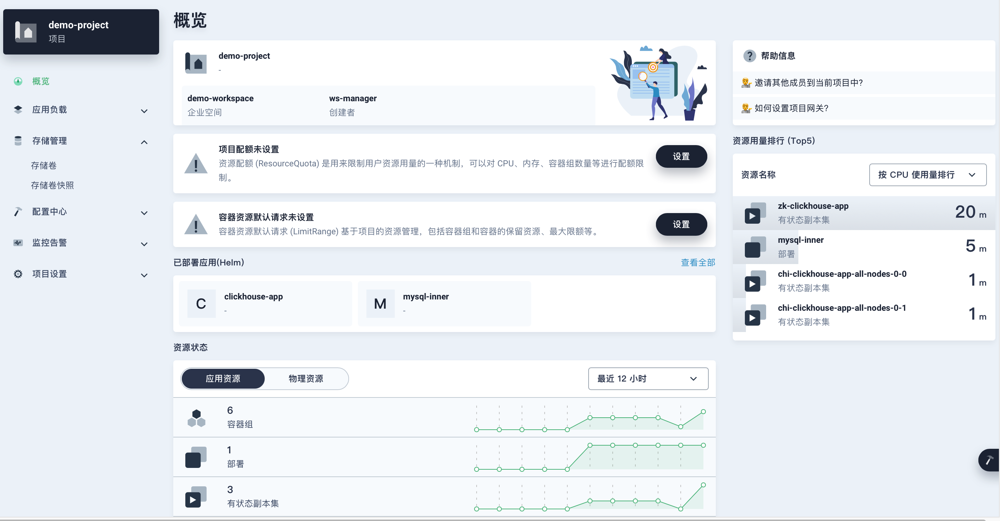

## 访问 RadonDB ClickHouse

1. 以 `admin` 身份登录 KubeSphere 的 Web 控制台，将鼠标悬停在右下角的锤子图标上，选择 **Kubectl**。

2. 打开终端窗口，执行如下命令，并输入 ClickHouse 集群用户名和密码。

   ```bash
   kubectl edit chi <app name> -n <project name>
   ```
   > **注意**
   >
   > 以下命令示例中 **app name** 为 `clickhouse-app` ，**project name** 为 `demo-project`。

   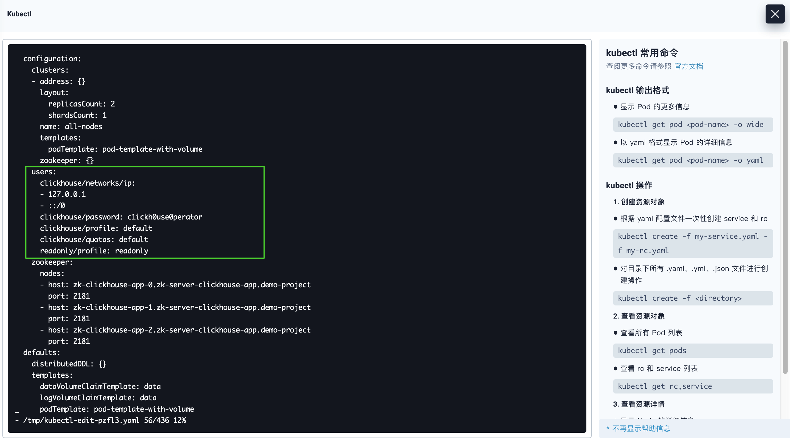

3. 执行如下命令，访问 ClickHouse 集群，并可通过 `show databases` 命令查看数据库。

   ```bash
   kubectl exec -it <pod name> -n <project name> -- clickhouse-client --user=<user name> --password=<user password>
   ```

   > **注意**
   >
   > - 以下命令示例中 **pod name** 为 `chi-clickhouse-app-all-nodes-0-1-0` ，**project name** 为 `demo-project`，**user name** 为 `clickhouse`，**password** 为  `clickh0use0perator`。
   >
   > - 可在**应用负载**的**容器组**下获取 **pod name**。

   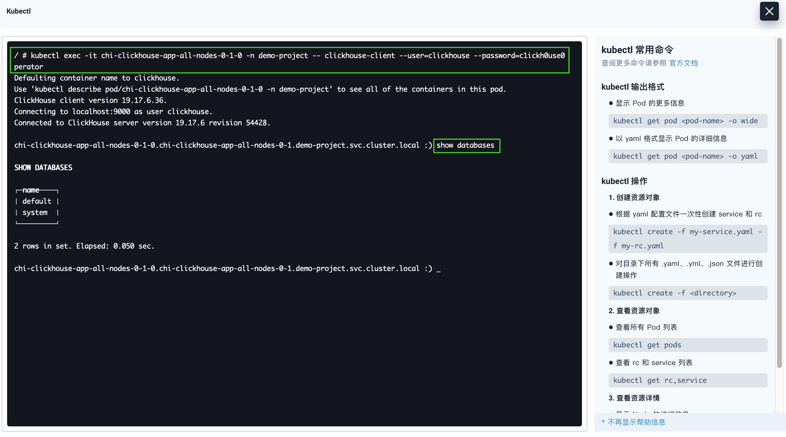
